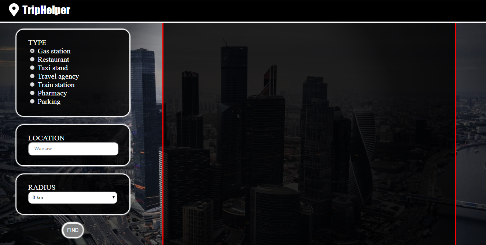
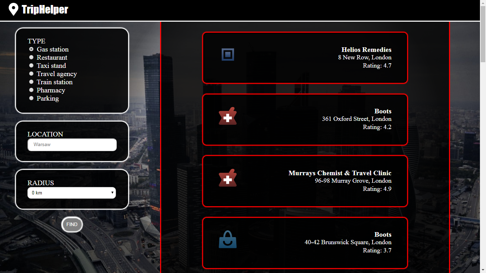

# TripHelper
## At first...
This is my non-profit project to training Spring Boot.

## 1. Table of contents
* [General info](#2-general-info)
* [Technologies](#3-technologies)

## 2. General info
TripHelper App!

This app helps you in the journey around the world. Menu on the left has 3 submenu:
* Type - Type of place, which you want to find
* Location - Name your selected city
* Radius - How far the app must search for the target

Default params are gas stations in Warsaw, radius - 0 km.

EXAMPLE - We entry Pharmacy, London, 10 km. At first TripHelper gets our param and sends base url with location name to
Find Place Google Api. Gets information about location coordinates, next to sends base url with coordinates, radius
and type of place to Nearby Search Google Api. Finally application gets results and shows paragraphs.

First paragraph is name of place, second is address and third is rating on Google. At every result we have place icon
compare to type of place.

App maps all result from Nearby Search Google Api to ResultDTO.

## 3. Technologies
Project is created with:
* Java version: 1.8
* Spring Boot version: 2
* Thymeleaf
* Lombok

